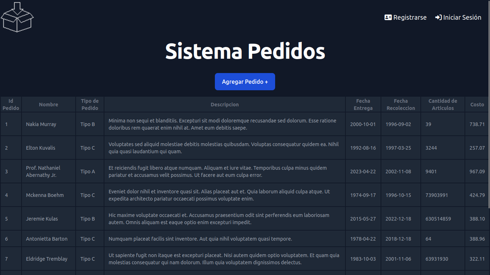
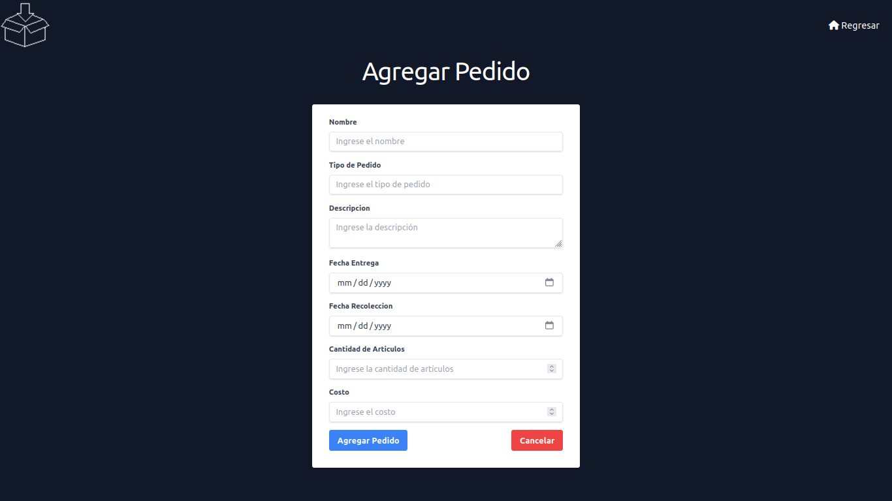
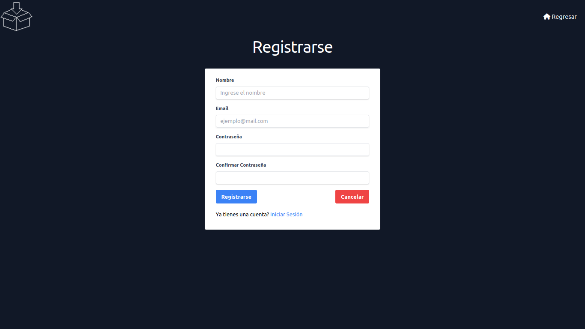
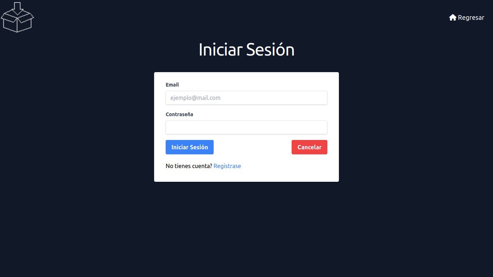
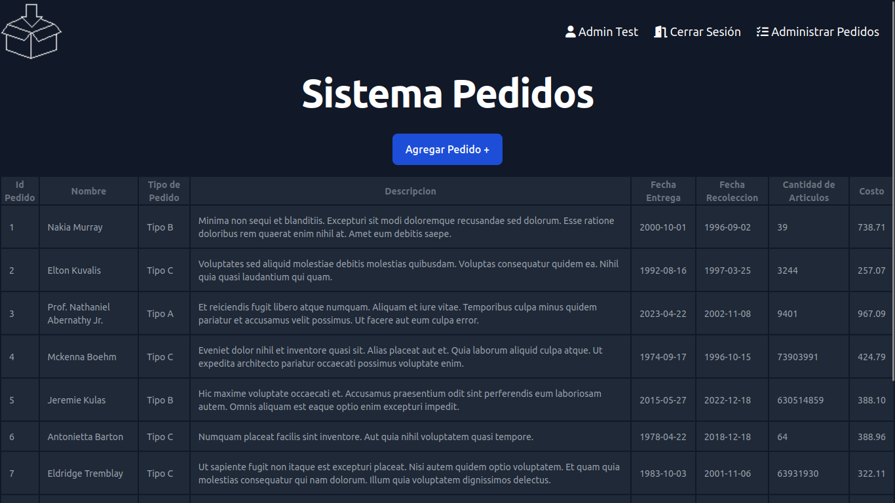
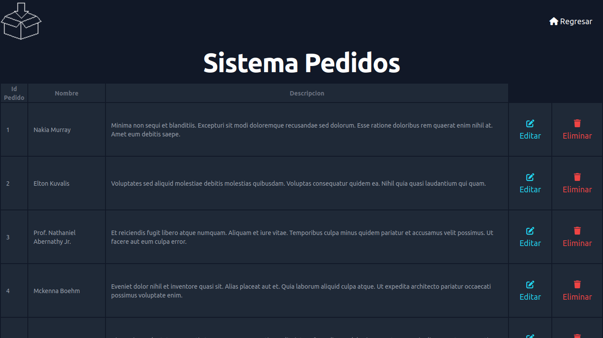
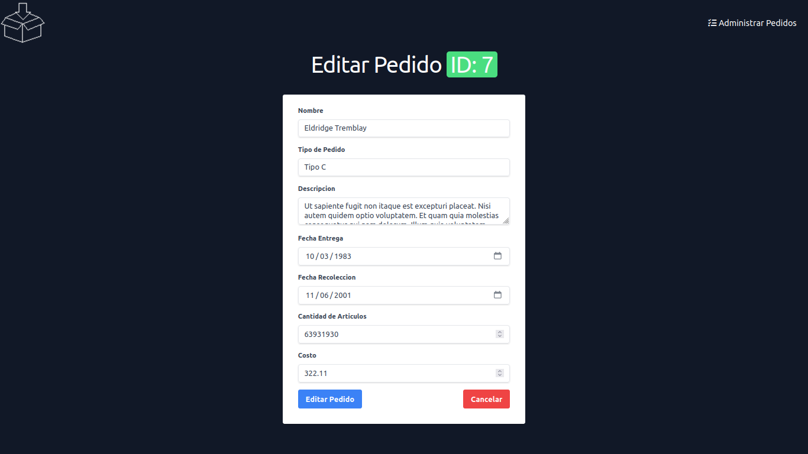

# Sistema Pedidos

Sistema Pedidos, es una aplicación diseñada para manejar y organizar pedidos de manera eficiente. Los usuarios pueden registrarse en esta app para administrar los pedidos.

## Requisitos del Sistema

- PHP >= 8.1
- MySQL >= 8.0
- Composer
- Laravel Framework >= 10.10

## Instalación

1. Clona este repositorio en tu máquina local.
```bash
git clone https://github.com/victorlvl47/orders-system.git
```

2. Instala las dependencias del proyecto
```bash
composer install
```

3. Copia el archivo de configuración `.env.example` y renómbralo como `.env`. Luego, actualiza las variables de entorno con la configuración adecuada para tu entorno local.

4. Genera una nueva clave de aplicación.

5. Crea una base de datos MySQL vacía para el proyecto.

6. Actualiza las credenciales de la base de datos en el archivo `.env`.

7. Ejecuta las migraciones y seed para crear las tablas y los datos en la base de datos.
```bash
php artisan migrate:refresh --seed
```

8. Inicia el servidor de desarrollo de Laravel.
```
php artisan serve
```

9. Abre tu navegador web y accede a la aplicación. (Por lo general `http://localhost:8000`). Puedes acceder con el siguiente usuario de prueba.

| Name    | Email         | Password |
|---------|---------------|----------|
| Admin Test    | admintest@mail.com | 123456 |

## Vistas
### Listado Pedidos


### Agregar Pedido


### Registrar Nuevo Usuario


### Login


### Usuario Autenticado


### Administrar Pedidos. Editar y Eliminar


## Editar Pedido



